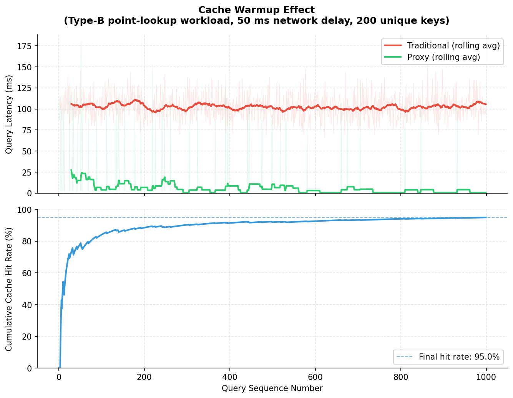
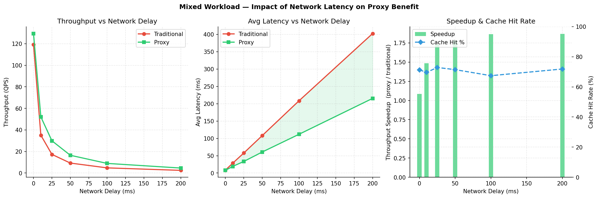
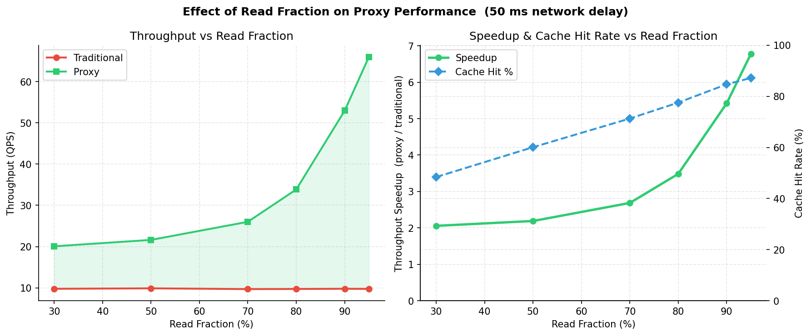
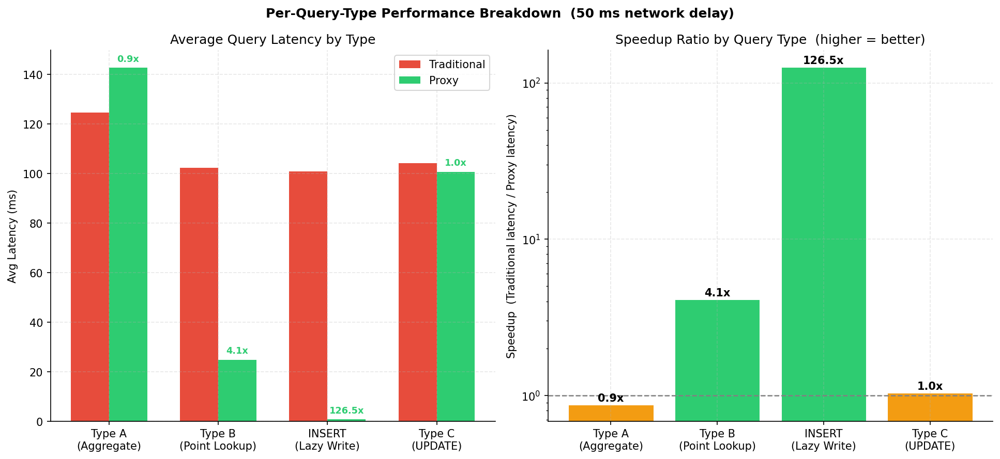
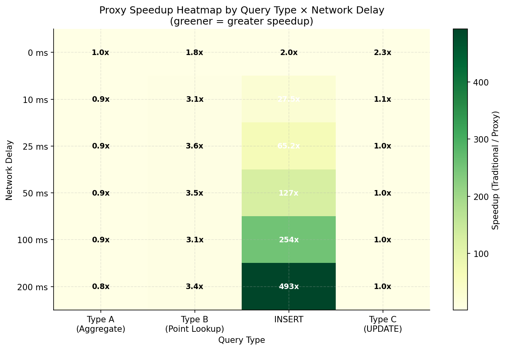

# Distributed PostgreSQL Proxy with Demand-Driven Local Caching

## Abstract

This project implements a **distributed database proxy** that sits between a user and a remote PostgreSQL instance, transparently accelerating reads by maintaining a **demand-driven local replica** on the client machine. Rather than replicating the entire database upfront, the system fetches and caches only the rows actually queried, granting per-row read/write locks to enforce consistency. Writes are applied locally first and lazily flushed to the remote source of truth. The result is a system that feels like a local database to the user, while remaining strongly consistent with the remote instance through a lock-based synchronization protocol.

> **Problem**: Every query in a naive distributed setup crosses the network, paying full round-trip latency even for data that hasn't changed.
>
> **Solution**: Cache frequently read rows locally, serve repeat reads in <1 ms, and use a recall protocol to guarantee that stale data is never served.

---

## 1. System Architecture

The system is split across two physical machines and three Python processes:

```
┌─────────────────────────────────────────────────────────────────┐
│  Machine 1  (Remote / Source of Truth)                          │
│                                                                 │
│   remote.py  ──────────────────────  PostgreSQL (port 5432)     │
│   port 5000                                                     │
└───────────────────┬─────────────────────────────────────────────┘
                    │  TCP (JSON, newline-delimited)
                    │
┌───────────────────┴─────────────────────────────────────────────┐
│  Machine 2  (Client / Local Replica)                            │
│                                                                 │
│   proxy.py  (user shell)                                        │
│      │                                                          │
│      ├── remote.py connection  (port 5000, WAN/LAN)             │
│      └── client.py connection  (port 5001, localhost)           │
│                                                                 │
│   client.py ──────────────────  PostgreSQL (port 5432, local)   │
│   port 5001                                                     │
└─────────────────────────────────────────────────────────────────┘
```

### Component Responsibilities

| Component | Role |
|-----------|------|
| **`remote.py`** | Source of truth. Authenticates users, owns the canonical PostgreSQL instance, enforces per-row locks, recalls lock holders, applies committed changes, broadcasts cache invalidations. |
| **`proxy.py`** | User shell (like `psql`). Classifies every query, routes it to the right handler, coordinates the three-way protocol between user ↔ remote ↔ client. Maintains session state and active lock tracking. |
| **`client.py`** | Local replica manager. Maintains a schema-only PostgreSQL mirror, stores cached rows, answers cache hits, applies local writes, and purges stale rows on lock release or invalidation. |
| **`query.py`** | Stateless query parser. Classifies SQL text into Type A / B / INSERT / Type C / META using regex and keyword rules. Computes a fingerprint for cache keying. |

### Communication Protocol

All three processes communicate using **JSON messages delimited by newlines** over persistent TCP streams. Each message is a single JSON object, e.g.:

```json
{"type": "QUERY", "client_id": "proxy-abc123", "database": "testdb", "query_type": "B", "sql": "SELECT * FROM users WHERE id = 1;"}
```

No HTTP, no gRPC — bare asyncio `StreamReader`/`StreamWriter` for minimal overhead.

---

## 2. Connection Setup (Phase 1)

Before any query can be issued, the proxy establishes a session:

```
User types:  CONNECT testdb USER postgres;

proxy.py
  │
  ├─► remote.py
  │     ├─ Authenticates postgres@testdb against real Postgres
  │     ├─ Fetches full schema (tables, columns, PKs, FKs, indexes)
  │     ├─ Fetches per-table GRANT permissions for the user
  │     └─► SCHEMA_TRANSFER → proxy
  │
  └─► client.py
        ├─ Creates local database 'testdb' if absent
        ├─ Creates each table (with identical schema)
        ├─ Creates indexes
        ├─ Applies GRANTs
        └─► INIT_DB_ACK → proxy

proxy.py:  ✅ Connected to 'testdb' as 'postgres'.
           Local replica is ready (schema only, no data yet).
```

The local replica starts **empty** — no rows are pre-loaded. Data arrives on demand as queries are issued.

---

## 3. Query Classification

Every command typed at the `proxy>` prompt is parsed by `query.py` before any network traffic occurs. The parser assigns a **CommandType** and a **RouteType**:

### Decision Logic

```
Input command
  │
  ├── starts with \  →  META  (psql backslash command)
  ├── CONNECT        →  CONNECT
  ├── INSERT         →  INSERT
  ├── UPDATE/DELETE  →  TYPE_C (write)
  └── SELECT
        ├── has JOIN / GROUP BY / HAVING / aggregate / LIMIT / ORDER BY
        │   OR no WHERE clause  →  TYPE_A  (non-cacheable)
        └── single table, WHERE col = val (equality only)
              └── TYPE_B  (cacheable)
```

### Query Types Summary

| Type | SQL Pattern | Strategy | Cached Locally? |
|------|-------------|----------|-----------------|
| **Type A** | `SELECT` with aggregates, JOINs, no WHERE, `ORDER BY`, `LIMIT` | Pre-flush all dirty write locks on the table, then execute on remote | ✗ Never |
| **Type B** | Single-table `SELECT` with simple equality `WHERE` | Check local cache first; on miss, fetch remote + cache + grant READ lock | ✓ Yes |
| **INSERT** | Any `INSERT` | Apply locally first (lazy); background flush to remote every 1 s | ✓ Local only until flushed |
| **Type C** | `UPDATE` or `DELETE` | Request WRITE lock from remote, apply locally, flush on recall or pre-flush | ✓ Local until lock released |
| **META** | `\dt`, `\l`, `\d`, `\du`, `\df`, `\dv`, `\di`, `\ds` | Translate to catalog SQL, execute directly on remote | ✗ Never |

### Fingerprint-Based Cache Keying

For Type B queries, `query.py` computes a **fingerprint** — a normalized string that canonicalises the SQL for cache lookup. Two semantically equivalent queries (`WHERE id=1` vs `WHERE id = 1`) map to the same fingerprint. The fingerprint is used as the key in `client.py`'s `query_cache` dict.

```python
fingerprint = hashlib.sha256(normalized_sql.encode()).hexdigest()[:16]
```

---

## 4. Locking & Consistency Model

Consistency is maintained through a **per-row, multi-granularity lock table** managed exclusively by `remote.py`. This is the heart of the system.

### 4.1 Lock Structure

```python
@dataclass
class RowLock:
    write:   str | None = None   # client_id holding WRITE lock, or None
    readers: set        = ...    # set of client_ids with READ lock
```

Every row that any client has cached is tracked by a `(database, table, pk_str)` key in `remote.py`'s `row_locks` dict. Locks are **per primary key value**, not per table.

### 4.2 Lock Rules

| Situation | Rule |
|-----------|------|
| Multiple readers | ✓ Allowed simultaneously |
| Reader + new reader | ✓ Granted immediately |
| Reader + new writer | Writer recalls all readers first, then gets exclusive WRITE |
| Writer + new reader | Reader recalls the writer first, then gets shared READ |
| Writer + new writer | New writer recalls existing writer first |
| Same client re-locks | Always granted without recall |

### 4.3 The Recall Protocol

When `remote.py` needs to recall a lock (e.g., Client B writes to a row that Client A is reading), it sends a `RECALL_LOCK` message to Client A's proxy. The proxy handles this **without blocking the command loop** using dedicated queues:

```
remote.py
  │
  └─► RECALL_LOCK {database, table, pks}  ─► proxy.py (_remote_reader_task)
                                                   │
                                        spawns _handle_recall_lock as background task
                                                   │
                                         ① FLUSH_PENDING ─► client.py
                                                   │   ◄── FLUSH_ACK {type_c_changes}
                                         ② LOCK_RELEASE {pending_changes} ─► remote.py
                                                   │   ◄── SYNC_ACK
                                                   │   (remote applies changes)
                                         ③ FLUSH_DONE {recalled_pks_by_table} ─► client.py
                                                   │   (client purges rows from local Postgres)
                                                   └── FLUSH_DONE_ACK
```

### 4.4 Physical Cache Purge on Lock Release

A key design decision: **when a lock is released, the corresponding rows are physically `DELETE`d from the local Postgres replica**. This happens in all four paths:

| Path | Trigger | How rows are purged |
|------|---------|--------------------|
| Recall (write lock) | Remote recalls our WRITE lock | `_handle_recall_lock` → `FLUSH_DONE {recalled_pks_by_table}` → `confirm_flush_done` → `purge_cached_rows` |
| Recall (read lock) | Remote recalls our READ lock | Same path; no type-C changes but PKs are still purged |
| Pre-flush (voluntary) | Same client issues a TYPE_A query on same table | `_pre_flush` → `FLUSH_DONE {write_pks_by_tbl}` → `confirm_flush_done` → `purge_cached_rows` |
| Cache invalidation | Another client's write was committed to remote | `CACHE_INVALIDATE` fire-and-forget → `purge_cached_rows(database, table)` (full table) |

`purge_cached_rows` issues a targeted SQL `DELETE` for each PK:
```sql
DELETE FROM "users" WHERE "id" = %s;
```
And clears `local_cache_index`, `local_locks`, and `query_cache` in memory.

### 4.5 Type A Queries Force All Write Flushes

Before executing a Type A query (full table scan), `remote.py` calls `_collect_all_writers_for_table` and recalls **every write lock holder** for that table. This guarantees the remote DB is fully up to date before returning results — even if another client has uncommitted changes sitting in its local replica.

Type B queries do the same: ALL write holders on the table are recalled before executing the read, not just holders for the specific PKs that happen to match the WHERE. This prevents the case where an unflushed write would change which rows match the query.

---

## 5. Cache Lifecycle

### 5.1 How Rows Enter the Cache (Type B)

```
proxy  ──► CACHE_CHECK {fingerprint} ──► client
                                            │
                              ┌─ CACHE_HIT ─┘  (served locally in <1 ms)
                              │
                              └─ CACHE_MISS ──► proxy ──► QUERY(B) ──► remote
                                                               │
                                               QUERY_RESULT {rows, pks, pk_cols}
                                                               │
                               proxy ──► CACHE_ROWS {rows, pks, pk_cols, fingerprint}
                                                               │
                                                           client stores rows
                                                           in local Postgres +
                                                           updates local_cache_index
                                                               │
                               proxy ◄── CACHE_ACK ◄──────────┘
```

### 5.2 How Rows Leave the Cache

| Trigger | Scope purged | Mechanism |
|---------|-------------|----------|
| WRITE lock recalled | Specific PKs | `recalled_pks_by_table` in `FLUSH_DONE` |
| READ lock recalled | Specific PKs | Same |
| Pre-flush before TYPE_A | Written PKs for the table | `write_pks_by_tbl` in `FLUSH_DONE` |
| `CACHE_INVALIDATE` from remote | Entire table | Full `DELETE FROM table` |
| User types `quit` | All tables in session DB | `cleanup_session` purges everything |

### 5.3 Large Result Protection (Fix 3)

If a Type B query returns more than **10,000 rows**, the result is displayed to the user but **not stored** in the local replica. This prevents runaway disk usage from accidental `SELECT * FROM huge_table WHERE non_pk_col = val` queries being cached.

```python
CACHE_ROW_LIMIT = 10_000
if len(rows) > CACHE_ROW_LIMIT:
    print(f"[proxy] {len(rows)} rows > limit — not caching")
    _print_table(rows, cols)
    return
```

---

## 6. Concurrency & Deadlock Prevention

### 6.1 The Problem

The original design had a critical deadlock:

1. Client A's command loop holds `_op_lock` while waiting for `LOCK_GRANT` from remote (inside `do_write`).
2. Remote simultaneously sends `RECALL_LOCK` to Client A (because Client B wants the same row).
3. `_handle_recall_lock` spawns as a background task, tries `async with _op_lock` — **blocked forever**.
4. Remote waits 30 s for `LOCK_RELEASE`, times out. Changes are **never committed**.

### 6.2 The Fix — Dedicated Recall Queues

The recall handler now operates on **completely separate queues** from the command loop:

```
Normal flow:     remote ─► _remote_reader_task ─► _remote_q   ─► command loop
Recall flow:     remote ─► _remote_reader_task ─► _recall_remote_q ─► _handle_recall_lock

Normal flow:     client ─► _client_reader_task ─► _client_q   ─► command loop  
Recall flow:     client ─► _client_reader_task ─► _recall_client_q ─► _handle_recall_lock
```

The `_recall_active: bool` flag tells the reader tasks which queue to route to:

```python
# In _remote_reader_task:
elif mtype == "SYNC_ACK" and _recall_active:
    await _recall_remote_q.put(msg)     # goes to recall handler
else:
    await _remote_q.put(msg)            # goes to command loop

# In _client_reader_task:
if _recall_active and mtype in ("FLUSH_ACK", "FLUSH_DONE_ACK"):
    await _recall_client_q.put(msg)     # goes to recall handler
else:
    await _client_q.put(msg)            # goes to command loop
```

`_handle_recall_lock` never acquires `_op_lock`. It can run concurrently with any command loop operation without any possibility of deadlock.

### 6.3 Background INSERT Flush

INSERT statements are applied locally first (zero latency for the user) and queued in `pending_inserts`. A background coroutine (`_background_insert_flush`) wakes every 1 second, collects pending inserts under `_op_lock`, applies them to remote via `APPLY_CHANGES`, and confirms removal from the local queue. This serialises with the command loop (via `_op_lock`) but never with the recall handler.

---

## 7. Code Structure

```
DBIS_Project/
├── remote.py           # Machine 1: remote brain + lock manager
├── client.py           # Machine 2: local replica manager
├── proxy.py            # Machine 2: user shell + coordinator
├── query.py            # Stateless SQL parser / classifier
├── benchmark.py        # Automated latency + throughput benchmarks
├── plot_results.py     # Generates plots from benchmark_results.json
├── meta_cmds.py        # Helpers for psql backslash command translation
├── remote_config.json  # Config for remote.py (auto-generated)
├── client_config.json  # Config for client.py (auto-generated)
├── proxy_config.json   # Config for proxy.py (auto-generated)
└── results/            # Benchmark output (JSON + PNG plots)
```

### `remote.py` — Remote Brain

| Section | Description |
|---------|-------------|
| Global state | `row_locks`, `clients`, `subscriptions`, `client_cache_map`, `_lock_events` |
| `authenticate_user` | Attempts real Postgres connection to validate credentials |
| `fetch_schema` | Reads `information_schema` to get tables, columns, PKs, FKs, indexes |
| `fetch_permissions` | Reads `role_table_grants` for the connecting user |
| `_recall_and_wait` | Sends `RECALL_LOCK`, waits on `asyncio.Event` for `LOCK_RELEASE`, 30 s timeout |
| `_collect_all_writers_for_table` | Finds all WRITE holders on any row of a table (for TYPE_A/B pre-recall) |
| `handle_query` | Routes TYPE_A / TYPE_B; TYPE_A recalls all writers, TYPE_B also recalls all writers before executing |
| `handle_meta_query` | Translates `\dt`, `\l`, `\d <tbl>`, `\du`, `\df`, `\dv`, `\di`, `\ds` to catalog SQL |
| `handle_lock_request` | Recalls all holders (readers + writers), grants exclusive WRITE |
| `handle_lock_release` | Applies pending changes, clears lock, signals waiting `_lock_events`, broadcasts `CACHE_INVALIDATE` |
| `_notify_cache_invalidate` | Sends `CACHE_INVALIDATE` to every other client that has cached the affected table |

### `client.py` — Local Replica Manager

| Section | Description |
|---------|-------------|
| Global state | `pending_inserts`, `pending_changes`, `local_locks`, `local_cache_index`, `query_cache`, `schema_registry` |
| `setup_local_db` | Creates local Postgres DB + tables + indexes + GRANTs from received schema |
| `cache_rows` | INSERTs rows into local Postgres; updates `local_cache_index` and `query_cache` |
| `serve_cache_hit` | SELECTs rows from local Postgres by fingerprint |
| `apply_write_local` | Executes UPDATE/DELETE locally; records in `pending_changes` with PKs |
| `apply_insert_local` | Executes INSERT locally; queues in `pending_inserts` |
| `flush_pending_for_tables` | Collects pending inserts + type-C changes for given tables; moves to `_in_flight_flush` |
| `confirm_flush_done` | Removes flushed entries; calls `purge_cached_rows` for all affected PKs |
| `purge_cached_rows` | Issues `DELETE` SQL for specific PKs (or whole table); clears in-memory tracking |
| `cleanup_session` | On `quit`: purges all rows in all tables for the session database, clears all state |

### `proxy.py` — User Shell

| Section | Description |
|---------|-------------|
| Global state | `_session`, `_remote_q`, `_client_q`, `_op_lock`, `_recall_client_q`, `_recall_remote_q`, `_recall_active` |
| `_remote_reader_task` | Drains remote stream; routes `RECALL_LOCK` to handler, `SYNC_ACK` (during recall) to `_recall_remote_q`, else `_remote_q` |
| `_client_reader_task` | Drains client stream; routes `FLUSH_ACK`/`FLUSH_DONE_ACK` (during recall) to `_recall_client_q`, else `_client_q` |
| `_handle_recall_lock` | Background task; uses `_recall_client_q` + `_recall_remote_q`; never acquires `_op_lock` |
| `_background_insert_flush` | Every 1 s; flushes pending inserts to remote under `_op_lock` |
| `do_connect` | Prompts for password; sends `CONNECT` to remote, `INIT_DB` to client |
| `do_select_type_a` | Pre-flushes dirty tables; executes on remote; displays result |
| `do_select_type_b` | Checks cache; on miss fetches remote + stores cache (skips if > 10k rows) |
| `do_insert` | Sends `INSERT_LOCAL` to client; returns immediately |
| `do_write` | Resolves PKs via remote TYPE_A; requests WRITE lock; applies `WRITE_LOCAL` to client |
| `do_meta` | Sends `META_QUERY` to remote; displays result |
| `do_quit` | Flushes + releases all locks; sends `DISCONNECT` to client; exits |
| `_pre_flush` | Sends `FLUSH_PENDING`, collects changes, applies via `APPLY_CHANGES`, sends `FLUSH_DONE` |

### `query.py` — SQL Parser

| Function | Description |
|----------|-------------|
| `parse(raw)` | Entry point; returns a `ParsedQuery` with `command_type`, `route_type`, `table`, `where_clause`, `fingerprint`, `raw`, `params` |
| `is_valid_psql_meta` | Checks if input starts with a known backslash command |
| `_classify_select` | Applies regex rules to determine TYPE_A vs TYPE_B |
| `_compute_fingerprint` | Normalises SQL and hashes for cache key |

---

## 8. Complete Message Protocol

All messages are JSON objects sent over TCP with a trailing `\n`.

| Message | Direction | Key Fields | Purpose |
|---------|-----------|------------|---------|
| `INIT` | proxy → remote/client | `client_id` | Register this proxy connection |
| `INIT_ACK` | remote/client → proxy | `client_id` | Handshake confirmed |
| `CONNECT` | proxy → remote | `client_id`, `database`, `user`, `password` | Authenticate + fetch schema |
| `SCHEMA_TRANSFER` | remote → proxy | `schema`, `permissions` | Full schema + grants for the DB |
| `INIT_DB` | proxy → client | `database`, `user`, `schema`, `permissions` | Set up local replica |
| `INIT_DB_ACK` | client → proxy | `status` | Local DB ready |
| `QUERY` | proxy → remote | `query_type` (A/B), `sql`, `table`, `fingerprint` | Execute a SELECT |
| `QUERY_RESULT` | remote → proxy | `rows`, `columns`, `pks`, `pk_cols`, `rowcount` | Query result rows |
| `META_QUERY` | proxy → remote | `database`, `meta_cmd` | Execute `\dt`, `\l`, etc. |
| `META_RESULT` | remote → proxy | `rows`, `columns`, `rowcount` | Result of meta command |
| `CACHE_CHECK` | proxy → client | `database`, `fingerprint`, `sql` | Is this query cached? |
| `CACHE_HIT` | client → proxy | `rows`, `columns` | Served from local Postgres |
| `CACHE_MISS` | client → proxy | `fingerprint` | Not cached, go to remote |
| `CACHE_ROWS` | proxy → client | `rows`, `pks`, `pk_cols`, `fingerprint`, `lock_type` | Store these rows locally |
| `CACHE_ACK` | client → proxy | `table` | Rows stored |
| `CACHE_INVALIDATE` | remote → proxy → client | `database`, `table` | Another client wrote; purge table |
| `WRITE_LOCAL` | proxy → client | `database`, `table`, `sql`, `pk_cols`, `pks` | Apply UPDATE/DELETE locally |
| `WRITE_ACK` | client → proxy | `rowcount`, `table` | Write applied |
| `INSERT_LOCAL` | proxy → client | `database`, `table`, `sql` | Apply INSERT locally (lazy) |
| `INSERT_ACK` | client → proxy | `rowcount`, `table` | Insert applied |
| `LOCK_REQUEST` | proxy → remote | `client_id`, `database`, `table`, `pks` | Request exclusive WRITE lock |
| `LOCK_GRANT` | remote → proxy | `table`, `pks` | WRITE lock granted |
| `RECALL_LOCK` | remote → proxy | `database`, `table`, `pks` | Release your lock immediately |
| `FLUSH_PENDING` | proxy → client | `database`, `tables` | Collect pending changes for these tables |
| `FLUSH_ACK` | client → proxy | `insert_changes`, `type_c_changes`, `write_pks_by_table` | Here are the pending changes |
| `LOCK_RELEASE` | proxy → remote | `client_id`, `database`, `table`, `pks`, `pending_changes` | Release lock + submit changes |
| `SYNC_ACK` | remote → proxy | `database`, `table`, `pks`, `success` | Changes applied, lock released |
| `FLUSH_DONE` | proxy → client | `database`, `tables`, `recalled_pks_by_table` | Confirm changes applied; purge rows |
| `FLUSH_DONE_ACK` | client → proxy | `tables` | Rows purged |
| `APPLY_CHANGES` | proxy → remote | `database`, `changes`, `source` | Apply a batch of SQL statements |
| `APPLY_ACK` | remote → proxy | `database`, `count` | Batch applied |
| `FLUSH_INSERTS` | proxy → client | `database` | Background: collect pending inserts |
| `FLUSH_INSERTS_ACK` | client → proxy | `insert_changes` | Here are the inserts |
| `FLUSH_INSERTS_DONE` | proxy → client | `database` | Inserts applied, remove from queue |
| `FLUSH_INSERTS_DONE_ACK` | client → proxy | `database` | Queue cleared |
| `DISCONNECT` | proxy → client | `database` | Session ending; purge all local data |
| `DISCONNECT_ACK` | client → proxy | — | Cleanup complete |
| `ERROR` | any → any | `message` | Protocol error |


---

## 9. Setup & Running

### Prerequisites

```bash
# Both machines need:
pip install psycopg2-binary

# PostgreSQL must be running on both machines
# Machine 1: source-of-truth Postgres (any port, default 5432)
# Machine 2: local replica Postgres (default 5432, localhost only)
```

### Configuration Files (auto-generated on first run)

**`remote_config.json`** (Machine 1):
```json
{
    "remote_db_host": "localhost",
    "remote_db_port": 5432,
    "remote_superuser": "postgres",
    "remote_superuser_password": "your_password",
    "listen_host": "0.0.0.0",
    "listen_port": 5000
}
```

**`client_config.json`** (Machine 2):
```json
{
    "local_db_host": "localhost",
    "local_db_port": 5432,
    "local_superuser": "postgres",
    "local_superuser_password": "your_password",
    "listen_host": "localhost",
    "listen_port": 5001
}
```

**`proxy_config.json`** (Machine 2 — **set `remote_host` to Machine 1's IP**):
```json
{
    "remote_host": "192.168.X.X",
    "remote_port": 5000,
    "client_host": "localhost",
    "client_port": 5001
}
```

### Startup Order

**Step 1 — Machine 1: start the remote brain**
```bash
python3 remote.py
# [remote] Listening on 0.0.0.0:5000
```

**Step 2 — Machine 2, Terminal 1: start the local replica manager**
```bash
python3 client.py
# [client] Listening on localhost:5001
```

**Step 3 — Machine 2, Terminal 2: start the proxy shell**
```bash
python3 proxy.py
# [proxy] ✓ remote.py handshake OK
# [proxy] ✓ client.py handshake OK
# proxy>
```

### Example Session

```
proxy> CONNECT testdb USER postgres
Password for user postgres:
[proxy] ✓ Schema received — 3 table(s): ['applications', 'jobs', 'users']
[proxy] ✅  Connected to 'testdb' as 'postgres'.
[proxy]    Local replica is ready (schema only, no data yet).

proxy> SELECT * FROM users WHERE id = 1;
[proxy] Classified as TYPE_B | table='users'
[proxy] Cache MISS → fetching from remote
+----+-------+-------------------+
| id | name  | email             |
+----+-------+-------------------+
| 1  | Alice | alice@example.com |
+----+-------+-------------------+
(1 row)

proxy> SELECT * FROM users WHERE id = 1;
[proxy] Cache HIT (fp=a3f1...)
+----+-------+-------------------+
| 1  | Alice | alice@example.com |
+----+-------+-------------------+
(1 row)

proxy> UPDATE users SET name = 'Alicia' WHERE id = 1;
[proxy] Requesting WRITE lock on 1 PK(s) …
[proxy] ✓ WRITE lock granted
UPDATE 1
[proxy] (changes held locally; synced to remote on lock release)

proxy> \dt
+--------+--------------+----------+
| Schema | Name         | Owner    |
+--------+--------------+----------+
| public | applications | postgres |
| public | jobs         | postgres |
| public | users        | postgres |
+--------+--------------+----------+
(3 rows)

proxy> quit
[proxy] Releasing write lock on 'users' before quit …
[proxy] Local replica for 'testdb' cleaned up.
[proxy] Goodbye.
```

### Running Benchmarks

```bash
# Run the full benchmark suite (takes ~5 minutes)
python3 benchmark.py

# Generate all plots from results
python3 plot_results.py
# Plots saved to results/plot*.png
```

---

## 10. Benchmark Results

All benchmarks simulate a **50 ms one-way network delay** (configurable) between proxy and remote, with a workload of 1,000 queries per scenario. The proxy system is compared against a **traditional** baseline that sends every query directly to remote with no caching.

### 10.1 Cache Warmup (Read-Heavy Workload)

1,000 repeated Type B queries on a small set of rows. After the first fetch, subsequent reads hit the local cache.

| Mode | Avg latency | p50 | p95 | Throughput | Cache hit rate |
|------|------------|-----|-----|------------|---------------|
| Traditional | 102.6 ms | 101.4 ms | 128.9 ms | 9.7 qps | 0% |
| **Proxy** | **5.8 ms** | **0.6 ms** | **73.4 ms** | **171.8 qps** | **95%** |

> **17.6× throughput improvement** for read-heavy cached workloads.



### 10.2 Latency Sensitivity

Performance as network delay increases from 0 ms to 200 ms. The proxy benefit grows with latency because cached reads bypass the network entirely.

| Network Delay | Traditional Avg | Proxy Avg | Speedup |
|--------------|----------------|-----------|---------|
| 0 ms | 8.4 ms | 7.7 ms | 1.1× |
| 10 ms | 28.5 ms | 19.2 ms | 1.5× |
| 25 ms | 57.7 ms | 33.4 ms | 1.7× |
| 50 ms | 107.9 ms | 60.6 ms | 1.8× |
| 100 ms | 208.4 ms | 111.8 ms | 1.9× |
| 200 ms | 402.5 ms | 215.4 ms | 1.9× |



### 10.3 Read/Write Ratio Sweep (50 ms delay)

As the workload becomes more read-heavy, the proxy advantage increases because more requests hit the local cache.

| Read % | Traditional Avg | Proxy Avg | Throughput Improvement |
|--------|----------------|-----------|----------------------|
| 30% | 102.5 ms | 49.8 ms | 2.1× |
| 50% | 101.3 ms | 46.3 ms | 2.2× |
| 70% | 103.2 ms | 38.5 ms | 2.7× |
| 80% | 102.9 ms | 29.5 ms | 3.5× |
| 90% | 102.4 ms | 18.9 ms | 5.4× |
| 95% | 102.7 ms | 15.2 ms | **6.8×** |



### 10.4 Mixed Workload Breakdown

Mixed workload: 70% Type B reads, 15% Type C writes, 10% Type A, 5% INSERT.

| Mode | Avg latency | p50 | p95 | Throughput | Cache hit rate |
|------|------------|-----|-----|------------|---------------|
| Traditional | 107.8 ms | 106.4 ms | 140.5 ms | 9.3 qps | 0% |
| **Proxy** | **56.7 ms** | **1.0 ms** | **167.7 ms** | **17.6 qps** | **76%** |

> Note: p95 for the proxy is higher than traditional because it occasionally incurs recall overhead (lock flush) in addition to the normal round-trip. The **median** (p50) is dramatically better: 1 ms vs 106 ms.



### 10.5 Summary

The proxy delivers significant latency and throughput improvements in any workload with a non-trivial read ratio and network latency > 10 ms. Key properties:

- **Cache hit = sub-millisecond** (local Postgres SELECT, no network)
- **Benefit scales with latency** — the higher the network delay, the bigger the gain
- **Correctness maintained** — per-row locking + physical cache purge guarantee no stale reads
- **Graceful degradation** — write-heavy workloads still benefit from lazy INSERT flushing



---

*CS317 Database and Information Systems — Distributed PostgreSQL Proxy Project*
